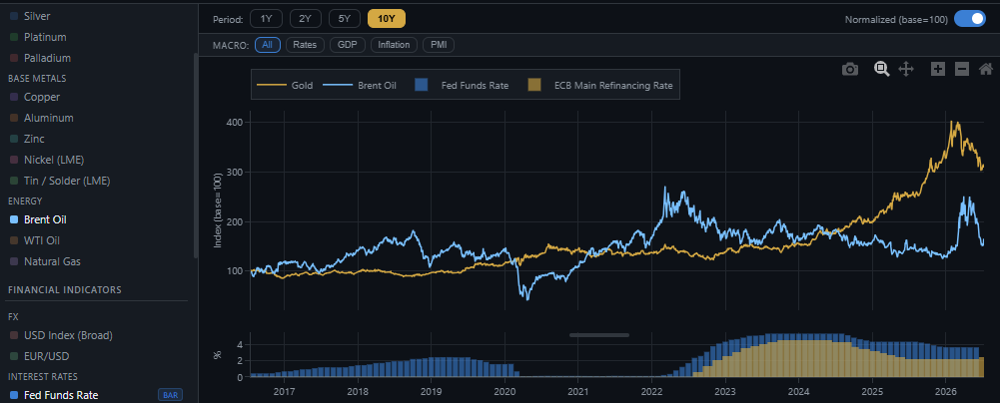
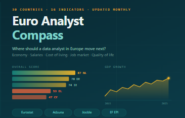
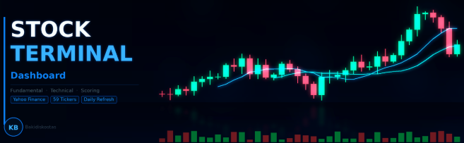
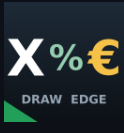

# Hi, I'm Konstantinos Bakidis 👋

**Procurement Controller → Data Analyst** | Finance & Markets Domain | Based in Germany

I combine hands-on controlling and procurement experience with a growing data analytics toolkit. My projects sit at the intersection of **financial markets**, **business intelligence**, and **automation** — built to solve real problems, not just to demonstrate skills.

---

## 🛠️ Tech Stack

**Core:** Python (pandas, requests, Plotly) · Power BI / DAX · Advanced Excel (Power Query, PivotTables) · REST APIs · GitHub Actions (CI/CD automation)

---

## 📂 Projects

### 📊 [Commodity & Financial Indicators Dashboard](https://github.com/Bakidiskostas/commodity-dashboard)
*Python · Plotly · GitHub Actions · Yahoo Finance · FRED*

Live dashboard tracking metals, energy, FX, interest rates, GDP and inflation — built for procurement controlling context. Base-100 normalization for cross-commodity comparison, FOMC-aligned forecast toggle with fan charts. Auto-refreshes weekly via GitHub Actions.

🔗 [Live Demo](https://bakidiskostas.github.io/commodity-dashboard/)

---

### 🌍 [Euro Analyst Compass](https://github.com/Bakidiskostas/euro-analyst)
*Python · Chart.js · Eurostat API · Adzuna API · Jooble API · GitHub Actions*

Interactive dashboard comparing 30 European countries across 16 indicators: economy, cost of living, job market, quality of life. Scoring model ranks each country 0–100 per indicator. Data refreshes automatically twice a month. Built for data-driven relocation and career research.

🔗 [Live Demo](https://bakidiskostas.github.io/euro-analyst/)

---

### 📈 [Stock Terminal Dashboard](https://github.com/Bakidiskostas/stock-dashboard)
*Python · HTML/JS · Yahoo Finance · Finviz*

Bloomberg-style multi-factor stock screener combining fundamental analysis (valuation, growth, margins) and technical signals (RSI, SMA200, Fibonacci). Custom scoring model ranks 80+ tickers. Reflects my background as an active investor with knowledge in both fundamental and technical analysis.

🔗 [Live Demo](https://bakidiskostas.github.io/stock-dashboard/stock_dashboard.html)

---

### ⚽ [Draw Strategy Backtest](https://github.com/Bakidiskostas/draw-strategy-backtest)
*Python · Plotly · Walk-Forward Methodology*

Rigorous backtest of a football draw-betting strategy across 29,000+ matches in 17 leagues using walk-forward simulation. Three staking modes tested. Published with an honest, data-driven conclusion — including where the strategy fails. Demonstrates statistical thinking and intellectual integrity over confirmation bias.

🔗 [Live Demo](https://bakidiskostas.github.io/draw-strategy-backtest/)

---

## 🎓 Background

- **BSc International Economics** — Democritus University of Thrace
- **Controlling Certificate** — ILS Hamburg
- **MS Office Specialist**
- Metallux AG: production → procurement controlling → monthly KPI reporting & dashboards

---

## 📬 Get in touch

---

*Languages: Greek 🇬🇷 (native) · German 🇩🇪 (B2) · English 🇬🇧 (B2)*
